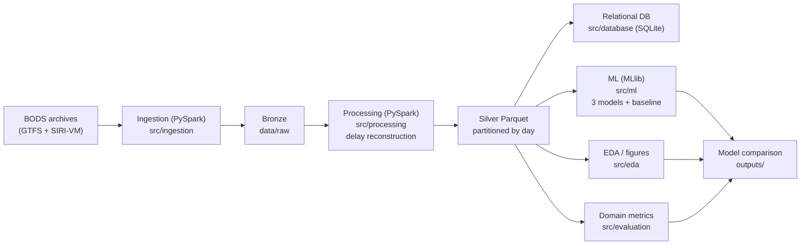

# Hybrid Bus Reliability and Delay Prediction Platform

Individual coursework project (ST5011CEM, Big Data Programming Project) building a PySpark-based platform
that predicts bus trip delay and translates it into Service Reliability metrics for a Regional Transport
Authority and Bus Operators.

## Data

Real bus timetable (GTFS) and vehicle-position (SIRI-VM) data for Greater Manchester, originating from the
Bus Open Data Service (BODS) under the Open Government Licence, for two service days (2026-06-30 and
2026-07-01). The vehicle feed carries no delay field, so observed delay is reconstructed by matching each
journey to its scheduled trip (see `src/processing/compute_delay.py`).

Scale: ~10.5M vehicle-position records and 2.59M scheduled stop-events processed in PySpark, yielding
150,955 cleaned delay events.

## Architecture



## Project structure

- `src/config/` — centralised SparkSession/DB configuration and shared geography
- `src/ingestion/` — GTFS and SIRI-VM loaders (bronze → silver)
- `src/processing/` — delay reconstruction (AVL ↔ timetable matching)
- `src/ml/` — feature engineering and model training/comparison
- `src/eda/` — dataset profiling and visualisations
- `src/evaluation/` — transport-domain reliability metrics
- `src/database/` — parameterised SQLite access layer
- `sql/` — schema, ER diagram, sample parameterised queries
- `scripts/` — entry-point scripts for each pipeline stage
- `tests/` — target-leakage guard
- `data/`, `outputs/` — gitignored (regenerable; see run order below)

## Pipeline run order

```
python scripts/smoke_test.py                        # verify Spark setup
python scripts/run_gtfs_ingestion.py                # North West GTFS -> GM silver
python scripts/run_sirivm_ingestion.py 20260630     # AVL positions per service day
python scripts/run_sirivm_ingestion.py 20260701
python scripts/run_compute_delay.py                 # reconstruct delay events
python scripts/load_db.py                           # load relational DB
python scripts/run_ml.py                            # train + compare models
python scripts/run_domain_metrics.py                # Service Reliability / TTV
python scripts/run_visualize.py                     # figures
python scripts/capture_spark_evidence.py --hold 180 # Spark evidence + UI screenshot
pytest tests/                                       # leakage guard
```

Raw data is not committed; download the two SIRI-VM day archives and the timetable archive from the
sources documented in the project's decision log, into `data/raw/`.

## Setup

Requires **Python 3.11** and **Java 17** (PySpark needs a JDK).

```
python -m venv .venv
.venv\Scripts\activate      # Windows
pip install -r requirements.txt
```

**SparkSession config**: `src/config/spark_session.py` sets `spark.sql.shuffle.partitions` and
`spark.default.parallelism` to 8 (project requires >=4 partitions), running in local mode.

**Environment note**: if a system-wide `SPARK_HOME` environment variable is already set to a different
Spark install, it will conflict with the `pyspark` version pinned in `requirements.txt` and cause a
`JavaPackage object is not callable` error. Unset `SPARK_HOME` for this project's shell session (don't
change it system-wide) before running any script here.

Verify the setup:
```
python scripts/smoke_test.py
```

## Database

Relational storage uses **SQLite** (Python stdlib, no server/credentials needed) with a
PostgreSQL-portable schema — see `sql/schema.sql` and `sql/er_diagram.md`. The database file path is read
from the `BUS_DB_PATH` environment variable (copy `.env.example` to `.env` to override; `.env` is
gitignored and must never hold committed credentials). If porting to PostgreSQL, supply connection
details via env, never hard-coded.

Load the cleaned analysis data into the DB (dimensions then fact, batch-inserted, foreign keys enforced):
```
python scripts/load_db.py
```
Sample parameterised analytical queries are in `sql/sample_queries.sql`. All DB access goes through the
parameterised helpers in `src/database/db.py` — no string-built SQL anywhere.
