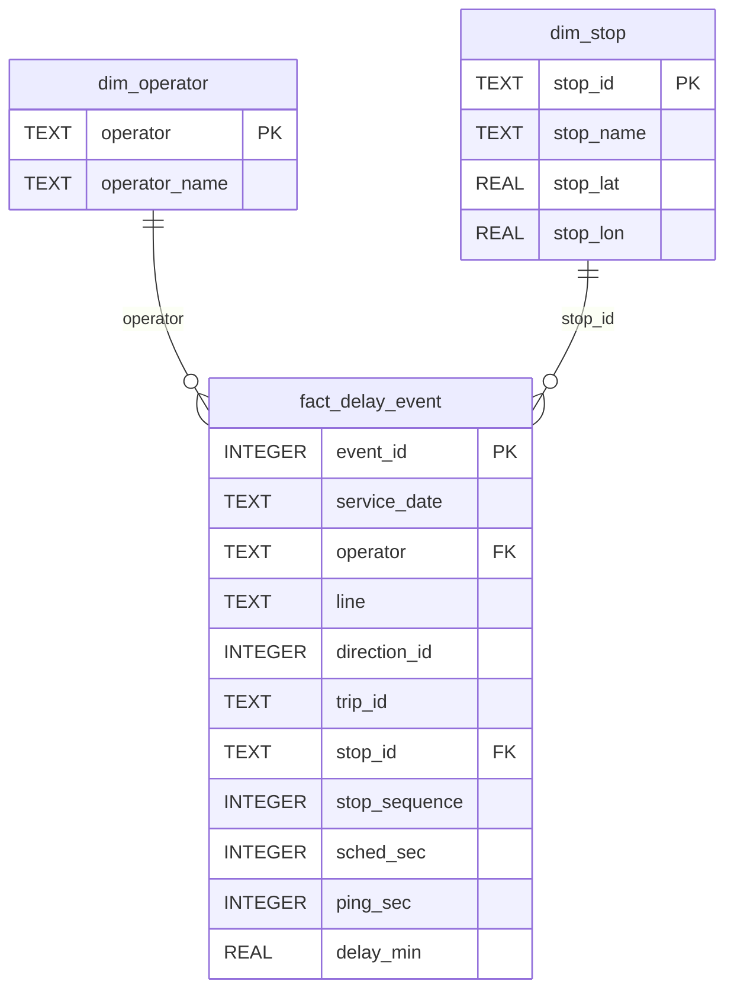

# Entity–Relationship Diagram

Relational schema for the delay-analysis database (see `schema.sql` and ADR-005). A star schema: the
`fact_delay_event` table references two dimensions via foreign keys (`operator`, `stop_id`).

Loaded counts (2 service days, see `scripts/load_db.py`): dim_operator = 18, dim_stop = 7,765,
fact_delay_event = 150,955. Foreign-key check passes with 0 violations.
